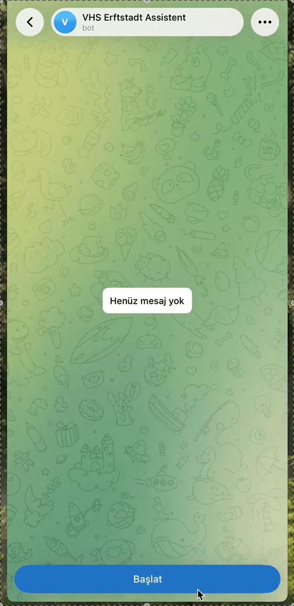

# VHS Erftstadt Kursdaten-Extraktor

Ein Python-Tool zur automatisierten Erfassung von Kursdaten der Volkshochschule (VHS) Erftstadt. Das Projekt sammelt strukturierte Informationen (Titel, Termin, Ort, Beschreibung, Gebühr, Dauer, Kursleitung) von der öffentlichen VHS-Website und bereitet sie für die Weiterverarbeitung auf – als Grundlage für ein geplantes mehrsprachiges Chatbot-Projekt (Deutsch, Englisch, Türkisch).

## Hintergrund

Dieses Projekt ist Teil meines persönlichen KI-Lernportfolios. Ziel ist es, praktische Erfahrung mit Web-Scraping, Datenaufbereitung und (in einem späteren Schritt) Retrieval-Augmented Generation (RAG) zu sammeln – mit einem realen, lokalen Anwendungsfall.

## Funktionsweise

Das Projekt besteht aus drei aufeinander aufbauenden Skripten:

1. **`scraper_full.py`** – Findet automatisch alle Kurskategorien der VHS-Website, durchläuft alle Seiten und sammelt Basisdaten (Titel, Termin, Ort, Kursnummer, Link) zu jedem Kurs.
2. **`kurs_detay.py`** – Besucht die Detailseite jedes einzelnen Kurses und ergänzt Beschreibungstext, Gebühr, Dauer, Kursleitung und Gruppengröße. Unterstützt Fortsetzung nach Unterbrechung.
3. **Datenbereinigung** – Entfernt HTML-Artefakte (z. B. `&reg;`) und normalisiert den Text für die Weiterverarbeitung.

## Verwendete Technologien

- Python 3.12
- `requests` – HTTP-Anfragen
- `BeautifulSoup4` – HTML-Parsing
- `json` – Datenspeicherung

## Hinweis zu den Daten

Dieses Repository enthält **nur den Quellcode**, keine vollständigen Kursdaten. Die gesammelten Daten stammen von der öffentlichen Website der VHS Erftstadt (vhs-erftstadt.de) und werden hier aus urheberrechtlichen Gründen nicht veröffentlicht. Dies ist kein offizielles Projekt der VHS Erftstadt.

## RAG-Pipeline (Retrieval-Augmented Generation)

Aufbauend auf den gesammelten Daten wurde ein lokales, kostenloses RAG-System implementiert:

4. **`index_kurslar.py`** – Wandelt jeden Kurs (Titel + Beschreibung) mittels eines mehrsprachigen Embedding-Modells (`paraphrase-multilingual-MiniLM-L12-v2`) in einen Vektor um und speichert ihn in einer lokalen Chroma-Vektordatenbank.
5. **`search_kurslar.py`** – Testet die semantische Suche: findet zu einer beliebigen Nutzeranfrage (in beliebiger Sprache) die relevantesten Kurse.
6. **`rag.py`** – Vollständige RAG-Pipeline: kombiniert die semantische Suche mit einem lokal laufenden Sprachmodell (Qwen2.5:7B via Ollama), das ausschließlich auf Basis der gefundenen Kursdaten in der Sprache der Nutzeranfrage antwortet.

Alle Komponenten laufen vollständig lokal und kostenlos (kein API-Schlüssel erforderlich), getestet auf einem Intel iMac (i9, 64GB RAM, AMD Radeon 580X) mit PyTorch MPS-Beschleunigung.

**Getestete Sprachen:** Deutsch, Englisch, Türkisch (zuverlässig) sowie Ukrainisch (funktionsfähig, mit gelegentlichen Unregelmäßigkeiten bei Eigennamen – erwartbar bei einem 7B-Modell).

## Telegram-Bot

7. **`rag_core.py`** – Enthält die zentrale RAG-Logik (Suche + Antwortgenerierung), wiederverwendbar für CLI und Bot.
8. **`bot.py`** – Mehrsprachiger Telegram-Bot, der Nutzeranfragen entgegennimmt und über `rag_core.py` beantwortet.

## Erweiterte Funktionen (Zeitfilterung & Kategorielisten)

9. **`kurs_tage_detay.py`** – Erfasst zusätzlich für jeden Kurs alle einzelnen Kurstage (Datum, Uhrzeit, Ort) sowie sämtliche Kursleiter:innen von der Detailseite, inklusive automatischer Verfolgung mehrseitiger Terminlisten.

Damit unterstützt das System nun:
- **Zeitbasierte Statusberechnung:** Für jeden Kurs wird anhand des Systemdatums präzise (in Python berechnet, nicht vom Sprachmodell geschätzt) bestimmt, ob er "noch nicht begonnen", "aktuell laufend" oder "abgeschlossen" ist.
- **Kategoriebasierte Vollständigkeitsabfrage:** Bei Anfragen wie "alle Kurse in [Kategorie] auflisten" wird die semantische Suche umgangen und direkt eine vollständige, garantiert korrekte Liste aus der Datenbank abgerufen (schneller und zuverlässiger als eine Modellantwort).

## Bekannte Einschränkungen

- Kategorieerkennung basiert auf einfachem Keyword-Matching (kein echtes Sprachverständnis) – funktioniert zuverlässig bei den getesteten Sprachen, ist aber keine vollständige NLU-Lösung
- Der Kurskategorie "Deutsch und Fremdsprachen" umfasst laut Website-Struktur ALLE Fremdsprachenkurse (nicht nur Deutsch) – dies spiegelt die Kategorisierung der VHS-Website wider, ist also korrektes Verhalten
- **Antwortzeit:** Auf dem verwendeten Intel-iMac (AMD-GPU) läuft Ollama ausschließlich CPU-basiert, da Metal-Beschleunigung nur auf Apple-Silicon-Geräten verfügbar ist. Dadurch dauern Antworten aktuell ca. 30–40 Sekunden. Auf Apple-Silicon-Hardware oder mit einer Cloud-API wäre die Antwortzeit deutlich kürzer.
- Gelegentliche kleinere grammatikalische Unregelmäßigkeiten in generierten Antworten (typisch für 7B-Modelle bei ressourcenschonendem lokalem Betrieb)

## Nächste Schritte

- Zeitbasierte Filterung (Kursstart + Dauer → aktueller Status)
- Hybride Suche: Kategoriefilter kombiniert mit semantischer Suche
- Integration in einen mehrsprachigen Telegram-Bot (Deutsch / Englisch / Türkisch)

## Autor

Yavuz Selim Burgu— im Rahmen der beruflichen Weiterbildung im Bereich KI/IT.
